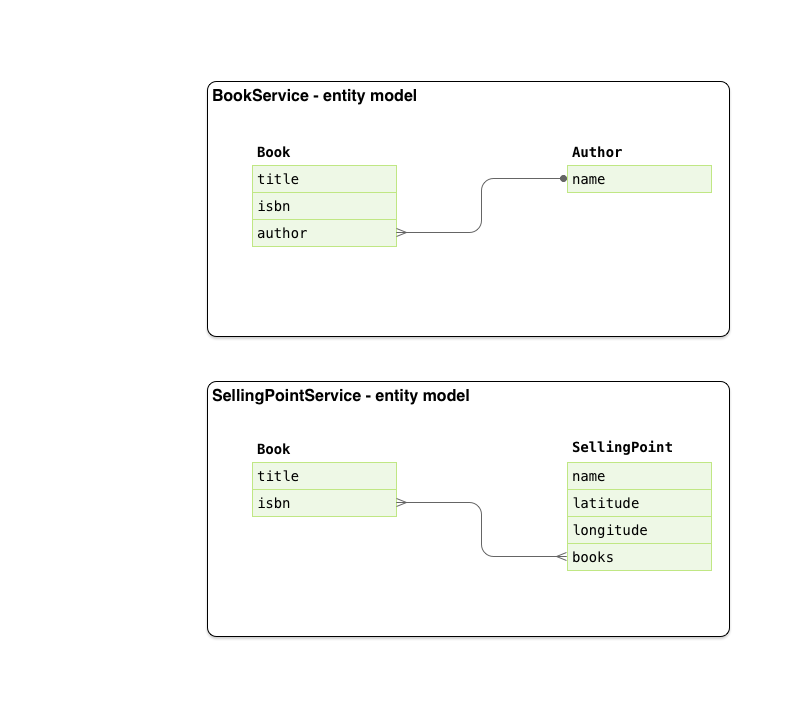
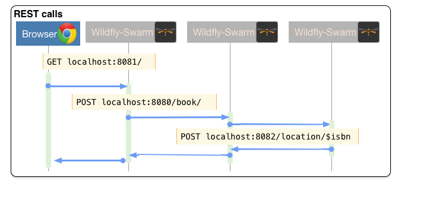

:sectanchors:
:toc: macro
:toclevels: 2
:toc-title: Table of Content
:numbered:

= Hands On Lab with Wildfly Swarm, Forge & Keycloak

toc::[]

== Goals

* Understand where to start when building microservices
* Get up and running deploying `microservices` on `Wildfly-Swarm` with `Forge`.
* Build a microservices based application using incremental steps to add capabilities along the way.
* Secure your application endpoints using `Keycloak`
* Manage your application performance with `Hawkular`
* Build `polyglot microservices` by replacing some of the services with their equivalent in `Node.js` and `Vert.X`
* Explore different deployment options of your `microservices` with `Docker` and `Openshift`

== Workflow Overview

While a microservices architecture doesn't mandate using a specific language for implementation we decided here to take a pragmatic approach, we will choose the `Java EE` path with `Wildfly-Swarm`, then later in our demo, once we completed our basic app, we will explore how these services can interact with other services that may be implemented using a different technology such as `Spring Boot`, `Vert.X`, `Node.JS` etc...
But let's keep that for the last section.

=== Workflow
As explained earlier this path will be implemented using Wildfly-Swarm. If you want to see how to work with other languages, skip to the last section.

image::images/msademo-greenfield-workflow.png[]

== The Use case for this Lab

* Create a bookstore app with Forge that contains :
** A book/Author model (title / author name)
** A SellingPoint Object containing location info (latitude / longitude)
*** This part with be extracted later as a swarm service
* Scaffold AngularJS front end for this app
* Initially deploy this app as an "old school" WAR on WF
* "explode" the app into 3 different swarm apps :
** A book/author service
** A Selling point service
** A front end (an "empty" swarm app containing just a web-app folder, ideally this should be a standalone webapp running nodejs, but is a bit out of scope for JavaOne audience)
* "secure" the 3 swarm apps with KeyCloak
** Here we introduce a 4th swarm app with the KeyCloak server
* Add Hibernate Search fraction to the Selling Point service and show geospatial queries
* Bonus point could be showing HB Search integration with Elastic Search

=== Entity Model

=== Workflow

=== Architecture Pattern

image::images/hol/Architecture%20Pattern.png[]

== Configure your environment and core services
In this section we will be following the steps as defined in the Overview section. The steps can be followed an executed as individual pieces or you can run the full `Forge` script script available link:wsfk-hol.fsh[here].

=== Setup Core Services

==== Security - Keycloak
We will be using the purposely build Keycloak Wildfly-Swarm `uberjar`.

Download:

- [x] http://central.maven.org/maven2/org/wildfly/swarm/servers/keycloak/2016.9/keycloak-2016.9-swarm.jar[Keycloak Server Uberjar]

==== Application Performance Management - Hawkular

We will be using the application performance management, distributed tracing and Business Transaction Management capabilities that are available with `https://github.com/hawkular/hawkular-apm[Hawkulat APM]`

To install  Hawkular APM you Download:

- [x] https://github.com/hawkular/hawkular-apm/releases/download/0.10.0.Final/hawkular-apm-agent.jar[Hawkualr APM Agent]
- [x] https://github.com/hawkular/hawkular-apm/releases/download/0.10.0.Final/hawkular-apm-dist-0.10.0.Final.tar[Hawkular APM Server]

=== Tools, SDK and IDEs
you will need to install the following on your machine:

- [x] http://www.oracle.com/technetwork/java/javase/downloads/jdk8-downloads-2133151.html[JDK 1.8]
- [x] https://maven.apache.org/download.cgi[Maven 3.3.6 or higher]
- [x] https://forge.jboss.org/[Forge 3.2.2 or higher]
- [x] http://developers.redhat.com/products/devstudio/download/?referrer=jbd[JBoss Developer Studio 10 (optional)]

=== Start Forge

image::images/forge-start.png[]

=== Start Core Services

==== Keycloak
==== Hawkular

== Let's build our services

=== Setup Wildfly-Swarm plugins
[source]
----
addon-install-from-git --url https://github.com/forge/wildfly-swarm-addon.git
addon-install-from-git --url https://github.com/forge/keycloak-addon.git
----

=== Create The BookService Project in Forge

[source]
----
# create the BookService project

# ----------------  Book Service [:8080/rest] ---------------
project-new --named bookservice --stack JAVA_EE_7

# create Author entity
jpa-new-entity --named Author
jpa-new-field --named name

# create Book entity and relationship with Author
jpa-new-entity --named Book
jpa-new-field --named title
jpa-new-field --named isbn
jpa-new-field --named author --type org.bookservice.model.Author --relationship-type Many-to-One

# create SellingPoint entity
jpa-new-entity --named SellingPoint
jpa-new-field --named name
jpa-new-field --named latitude --type Double
jpa-new-field --named longitude --type Double

# scaffold and create endpoints
scaffold-generate --provider AngularJS --generate-rest-resources --targets org.bookservice.model.*

# At this stage you can build and deploy a regular JAR
# and deploy to a Java EE7 compliant server like EAP 7 and Wildfly 10

# Since this lab is about Wildfly-Swam let's swarmify this
# Unless you which more control and create your own Main class,
# No change in your code is needed. Only Maven coordinate requires updating.

wildfly-swarm-setup
wildfly-swarm-detect-fractions --depend --build

# enable CORS
rest-new-cross-origin-resource-sharing-filter
----

=== Create The BookService Frontend Project in Forge

[source]
----
# ----------------  Book Store Web Front End [:8081/rest] ---------------
# Now we want to create front end swarm service to access BookService

project-new --named bookstorefrontend --stack JAVA_EE_7 --type wildfly-swarm --http-port 8081
wildfly-swarm-add-fraction --fractions undertow
mv ../bookservice/src/main/webapp/ src/main/

# manual step : change the url in the angular services to point
# to http://localhost:8080/rest/ in src/main/webapp/scripts/services
----

=== Create The SellingPoint service Project in Forge

[source]
----
# ----------------  SellingPoint Service [:8082/rest] ---------------
# create SellingPoint service

project-new --named sellingPoint --stack JAVA_EE_7 --type wildfly-swarm --http-port 8082
wildfly-swarm-add-fraction --fractions hibernate-search

# create Book entity and relationship with Author

jpa-new-entity --named Book
jpa-new-field --named isbn
java-add-annotation --annotation org.hibernate.search.annotations.Field --on-property isbn

# create Book entity and relationship with Author

jpa-new-entity --named SellingPoint
jpa-new-field --named name
java-add-annotation --annotation org.hibernate.search.annotations.Indexed
java-add-annotation --annotation org.hibernate.search.annotations.Spatial
jpa-new-field --named latitude --type Double
jpa-new-field --named longitude --type Double
java-add-annotation --annotation org.hibernate.search.annotations.Longitude --on-property longitude
java-add-annotation --annotation org.hibernate.search.annotations.Latitude --on-property latitude
jpa-new-field --named books --type org.sellingPoint.model.Book --relationship-type Many-to-Many --fetch-type EAGER
java-add-annotation --annotation org.hibernate.search.annotations.IndexedEmbedded --on-property books

scaffold-generate --provider AngularJS --generate-rest-resources --targets org.sellingPoint.model.*
wildfly-swarm-detect-fractions --depend --build

# enable CORS

rest-new-cross-origin-resource-sharing-filter
----
=== Add geospatial endpoint in SellingPoint 

In `src/main/java/org/sellingPoint/rest/SellingPointEndpoint.java` add this method : 

[source,java]
----
@GET
@Path("/inrange/{isbn}")
@Produces("application/json")
public List<SellingPoint> listByLocation(@PathParam("isbn") String isbn, @QueryParam("latitude") Double latitude,
		@QueryParam("longitude") Double longitude) {
	FullTextEntityManager fullTextEntityManager = Search.getFullTextEntityManager(em);
	QueryBuilder builder = fullTextEntityManager.getSearchFactory().buildQueryBuilder()
		.forEntity(SellingPoint.class).get();
	org.apache.lucene.search.Query luceneQuery = builder
		.spatial().within(5, Unit.KM).ofLatitude(latitude).andLongitude(longitude).createQuery();
	org.apache.lucene.search.Query keyWordQuery = builder
		.keyword().onField("books.isbn").matching(isbn).createQuery();
	Query boolQuery = builder.bool().must(luceneQuery).must(keyWordQuery).createQuery();
	javax.persistence.Query hibQuery = fullTextEntityManager.createFullTextQuery(boolQuery, SellingPoint.class);
	return hibQuery.getResultList();
}
----

=== Update Frontend App to consume the new SellingPoint Service 

[source, bash]
----
cp  frontend_assets/sellingpoint/search.html bookstorefrontend/src/main/webapp/views/SellingPoint
cp  frontend_assets/sellingpoint/searchSellingPointController.js bookstorefrontend/src/main/webapp/scripts/controllers
cp  frontend_assets/sellingpoint/SellingPointFactory.js bookstorefrontend/src/main/webapp/scripts/services
----

Now, from the `http://localhost:8081/app.html#/SellingPoints` you can search a specific Book by its `isbn` in a radius of 5 Km around you (your geolocation is automatically retrieved but you can override it on the search form). 

To get back at least one result, make sure that your boostrap data contains at least a SellingPoint that is your area or use the SellingPoint embedded frontend `http://localhost:8083/app.html`.  

=== Secure the endpoints with KeyCloak

==== Create Swarm Keycloak Server

[source,bash]
----
project-new --named keycloakserver --stack JAVA_EE_7 --type wildfly-swarm --http-port 8083 --fractions keycloak-server
----

==== Configure Keycloak Server

* Browse to the keycloak console `localhost:8083/auth` , you will have to create initially an Admin user
* Import `link:scripts/holrealm.json[the demo realm]`
* This realm create a test user : username: `sebi` / password : `password` 

==== Secure the services

(Be sure to start from the `link:scripts/[scripts]` folder)

[source]
----
# secure the bookService

cp bookservice_assets/keycloak.json bookservice/src/main/webapp/WEB-INF
cd bookservice

wildfly-swarm-add-fraction --fractions keycloak
security-add-login-config --auth-method KEYCLOAK --security-realm master
security-add-constraint --web-resource-name Book --url-patterns /rest/* --security-roles user

# The CORS filter is no longer needed, as KeyCloak will handle it from now
rm src/main/java/org/bookservice/rest/NewCrossOriginResourceSharingFilter.java

# redeploy and make sure the endpoint is protected by accessing directly its URL (i.e : localhost:8080/rest/books should show unauthorized)

cd ~~/..

# Secure the frontend
cp  frontend_assets/keycloak.json bookstorefrontend/src/main/webapp
cp  frontend_assets/keycloak.js bookstorefrontend/src/main/webapp/scripts/vendor
cp  frontend_assets/app.js bookstorefrontend/src/main/webapp/scripts
cp  frontend_assets/app.html bookstorefrontend/src/main/webapp
cd bookstorefrontend

# Redeploy the frontend, it should now redirect to the keycloak login screen

cd ~~/..

# secure the sellingPoint

cp sellingpoint_assets/keycloak.json sellingpoint/src/main/webapp/WEB-INF
cd sellingpoint
wildfly-swarm-add-fraction --fractions keycloak
security-add-login-config --auth-method KEYCLOAK --security-realm master
security-add-constraint --web-resource-name SellingPoint --url-patterns /rest/* --security-roles user
rm src/main/java/org/sellingPoint/rest/NewCrossOriginResourceSharingFilter.java

# SellingPoint is now secured.
----

=== Enable Application Performance Monitoring

[source]
----

----

=== Putting it all together
You can run all the above commands from a single script. `link:scripts/wsfk-hol.fsh[wsfk-hol.fsh]`

[source]
----
run wsfk-hol.fsh
----

Let's generate the `uberjar` and run, using either ways:

[source]
----
mvn package && java -jar ./target/mylab-swarm.jar
----
or
[source]
----
mvn wildfly-swarm:run
----
or via your IDE with the `Main` class.

=== Bootstrap data

IMPORTANT: For both of these scripts, make sure they have the name `import.sql` and put them in `src/main/resources` for each of the projects, they will be run at startup. 

For the BookService : 
[source,sql]
----
insert into Author  (id, name, version) values (1000,'Seb',0);
insert into Author  (id, name, version) values (1001,'George',0);

insert into Book  (id, title, isbn, author_id, version) values (1000,'Forge for Pro', '1001', 1000, 0);
insert into Book  (id, title, isbn, author_id, version) values (1000,'Swarm for Pro', '1002', 1001, 0);
----

For the SellingPoint Service : 
[source,sql]
----
insert into Book (id, isbn, version) values (1000, '1000',0);
insert into Book (id, isbn, version) values (1001, '1001',0);
insert into Book (id, isbn, version) values (1002, '1002',0);

insert into SellingPoint (id, latitude, longitude, name, version) values (2000, 43.5780, 7.0545, 'bob', 0);
insert into SellingPoint (id, latitude, longitude, name, version) values (2001, 43.574357, 7.1142449, 'chris',0);

insert into SellingPoint_Book (SellingPoint_id, books_id) values (2000,1000);
insert into SellingPoint_Book (SellingPoint_id, books_id) values (2000,1001);
----

== Extend the Demo with more capabilities
Now we have seen how to implement basic set of services, secure and monitor them, we would like to go one step further with moving those from traditional bare-metal environment to leverage new deployment model and targets. In the table below we explain briefly what capabilities are available in the different target environment to help you understand what you get for free or what you will to bring yourself depending on where you choose to deploy your services.

In this section we will demonstrate how to move the you build in the previous steps to Openshift and how you can benefit from its built-in capabilities.

[cols="1,1,1,1", options="header"]
.capabilities per target platforms
:===
Capabilities:Bare Metal:Container:Openshift

Management:yes [Hawkular Fraction] : yes : yes
Security:yes [KeyCloak Fraction] : yes : yes
Logging:::

:===

=== Polyglot microservices

In this section we will be taking some of our services and implementing them using Node.js, Vert.X and Spring Boot.
We want them to be able to communicate with others services, remain secured and being monitored.

=== Integration

Explore Camel here

=== Deploying on Openshift

While this Lab has been focused on single machine/single instance development, there are critical capabilities that needs to be addressed if we want to deploy our solutions in productions.
This section aims at listing those capabilities that comes for free in a PaaS environment like Openshift. We will demonstrate how our application can benefit from them.

==== Load balancing and fail-over
==== Discovery
==== API Mgt
==== Logging
