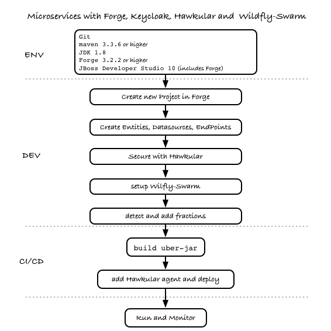
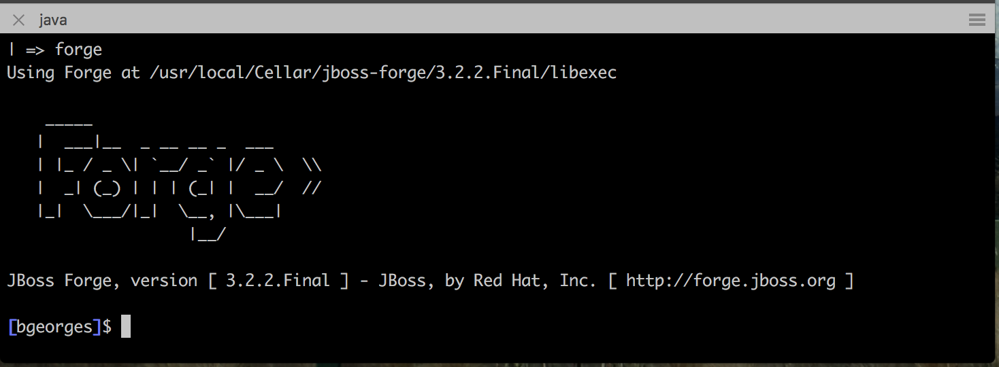

:sectanchors:
:toc: macro
:toclevels: 2
:toc-title: Table of Content
:numbered:

= Hands On Lab with Wildfly Swarm, Forge & Keycloak

toc::[]

== Goals

* Understand where to start when building microservices
* Get up and running deploying `microservices` on `Wildfly-Swarm` with `Forge`.
* Build a microservices based application using incremental steps to add capabilities along the way.
* Secure your application endpoints using `Keycloak`
* Manage your application performance with `Hawkular`
* Build `polyglot microservices` by replacing some of the services with their equivalent in `Node.js` and `Vert.X`
* Explore different deployment options of your `microservices` with `Docker` and `Openshift`

== Workflow Overview

While a microservices architecture doesn't mandate using a specific language for implementation we decided here to take a pragmatic approach, we will choose the `Java EE` path with `Wildfly-Swarm`, then later in our demo, once we completed our basic app, we will explore how these services can interact with other services that may be implemented using a different technology such as `Spring Boot`, `Vert.X`, `Node.JS` etc...
But let's keep that for the last section.

=== Workflow
As explained earlier this path will be implemented using Wildfly-Swarm. If you want to see how to work with other languages, skip to the last section.

== The Use case for this Lab

* Create a bookstore app with Forge that contains :
** A book/Author model (title / author name)
** A SellingPoint Object containing location info (latitude / longitude)
*** This part with be extracted later as a swarm service
* Scaffold AngularJS front end for this app
* Initially deploy this app as an "old school" WAR on WF
* "explode" the app into 3 different swarm apps :
** A book/author service
** A Selling point service
** A front end (an "empty" swarm app containing just a web-app folder, ideally this should be a standalone webapp running nodejs, but is a bit out of scope for JavaOne audience)
* "secure" the 3 swarm apps with KeyCloak
** Here we introduce a 4th swarm app with the KeyCloak server
* Add Hibernate Search fraction to the Selling Point service and show geospatial queries
* Bonus point could be showing HB Search integration with Elastic Search

== Configure your environment and core services
In this section we will be following the steps as defined in the Overview section. The steps can be followed an executed as individual pieces or you can run the full `Forge` script script available link:wsfk-hol.fsh[here].

=== Setup Core Services

==== Security - Keycloak
We will be using the purposely build Keycloak Wildfly-Swarm `uberjar`.

Download:

- [x] http://central.maven.org/maven2/org/wildfly/swarm/servers/keycloak/2016.8.1/keycloak-2016.8.1-swarm.jar[Keycloak Server Uberjar]

==== Application Performance Management - Hawkular

We will be using the application performance management, distributed tracing and Business Transaction Management capabilities that are available with `https://github.com/hawkular/hawkular-apm[Hawkulat APM]`

To install  Hawkular APM you Download:

- [x] https://github.com/hawkular/hawkular-apm/releases/download/0.10.0.Final/hawkular-apm-agent.jar[Hawkualr APM Agent]
- [x] https://github.com/hawkular/hawkular-apm/releases/download/0.10.0.Final/hawkular-apm-dist-0.10.0.Final.tar[Hawkular APM Server]

=== Tools, SDK and IDEs
you will need to install the following on your machine:

- [x] http://www.oracle.com/technetwork/java/javase/downloads/jdk8-downloads-2133151.html[JDK 1.8]
- [x] https://maven.apache.org/download.cgi[Maven 3.3.6 or higher]
- [x] https://forge.jboss.org/[Forge 3.2.2 or higher]
- [x] http://developers.redhat.com/products/devstudio/download/?referrer=jbd[JBoss Developer Studio 10 (optional)]

=== Start Forge

=== Start Core Services

==== Keycloack
==== Hawkular

== Let's build our services

=== Setup Wildfly-Swarm plugins
[source]
----
addon-install-from-git --url https://github.com/forge/wildfly-swarm-addon.git
addon-install-from-git --url https://github.com/forge/keycloak-addon.git
----

=== Create a new Project in Forge

[source]
----
project-new --named mylab --stack JAVA_EE_7 --type wildfly-swarm
----

=== Adding your entities, datasources, endpoints

[source]
----
jpa-new-entity --named Book
# Add fields to the Book entity
jpa-new-field --named title
...
# Create the REST endpoint for the entity
rest-generate-endpoints-from-entities --targets org.mylab.model.Book
----

=== Secure the endpoints with KeyCloak

IMPORTANT: You need a Keycloak server running on port 9000 and make sure that the Direct Access Grants Enabled option is enabled for this client

[source]
----
# Configure KeyCloak authentication
wildfly-swarm-add-fraction --fractions keycloak
security-add-login-config --auth-method KEYCLOAK --security-realm master
security-add-constraint --web-resource-name Book --url-patterns /rest/books --security-roles user

# Install the keycloak.json file to WEB-INF
keycloak-install-client-json --server-url http://localhost:9000/auth --realm master --client-id security-admin-console --user admin --password admin
----

=== Enable Application Performance Monitoring

[source]
----

----

=== Putting it all together
You can run all the above commands from a single script. `link:wsfk-hol.fsh[wsfk-hol.fsh]`

[source]
----
run wsfk-hol.fsh
----

Let's generate the `uberjar` and run, using either ways:

[source]
----
mvn package && java -jar ./target/mylab-swarm.jar
----
or
[source]
----
mvn wildfly-swarm:run
----
or via your IDE with the `Main` class.

== Extend the Demo with more capabilities
Now we have seen how to implement basic set of services, secure and monitor them, we would like to go one step further with moving those from traditional bare-metal environment to leverage new deployment model and targets. In the table below we explain briefly what capabilities are available in the different target environment to help you understand what you get for free or what you will to bring yourself depending on where you choose to deploy your services.

In this section we will demonstrate how to move the you build in the previous steps to Openshift and how you can benefit from its built-in capabilities.

[cols="1,1,1,1", options="header"]
.capabilities per target platforms
:===
Capabilities:Bare Metal:Container:Openshift

Management:yes [Hawkular Fraction] : yes : yes
Security:yes [KeyCloak Fraction] : yes : yes
Logging:::

:===

=== Polyglot microservices

In this section we will be taking some of our services and implementing them using Node.js, Vert.X and Spring Boot.
We want them to be able to communicate with others services, remain secured and being monitored.

=== Integration

Explore Camel here

=== Deploying on Openshift

While this Lab has been focused on single machine/single instance development, there are critical capabilities that needs to be addressed if we want to deploy our solutions in productions.
This section aims at listing those capabilities that comes for free in a PaaS environment like Openshift. We will demonstrate how our application can benefit from them.

==== Load balancing and fail-over
==== Discovery
==== API Mgt
==== Logging
